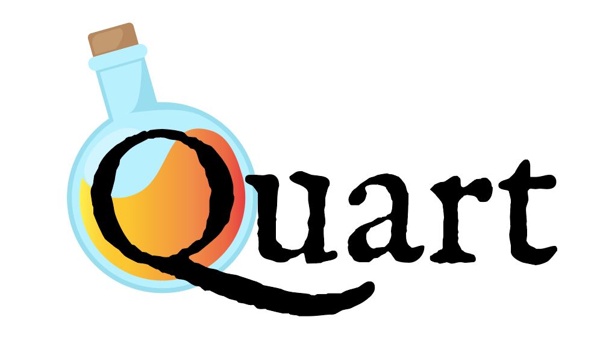

:orphan:

.. title:: Quart documentation

Quart
=====

Quart is a Fast Python web microframework. Using Quart you can,

 * write JSON APIs e.g. :ref:`a RESTful API<api_tutorial>`,
 * render and serve HTML e.g. :ref:`a blog<blog_tutorial>`,
 * serve WebSockets e.g. :ref:`a simple chat<chat_tutorial>`,
 * stream responses e.g. :ref:`serve video<video_tutorial>`,
 * all of the above in a single app,
 * or do pretty much anything over the HTTP or WebSocket protocols.

With all of the above possible using asynchronous (asyncio)
libraries/code or :ref:`synchronous<sync_code>` libraries/code.

If you are,

 * new to Python then start by reading :ref:`installation` instructions,
 * new to Quart then try the :ref:`quickstart`,
 * new to asyncio see the :ref:`asyncio` guide,
 * migrating from Flask see :ref:`flask_migration`,
 * looking for a cheatsheet then look :ref:`here<cheatsheet>`.

Quart is an asyncio reimplementation of the popular `Flask
<https://flask.palletsprojects.com>`_ microframework API. This means that if you
understand Flask you understand Quart. See :ref:`flask_evolution` to
learn more about how Quart builds on Flask.

Like Flask Quart has an ecosystem of
:ref:`extensions<quart_extensions>` for more specific needs. In
addition a number of the Flask :ref:`extensions<flask_extensions>`
work with Quart.

Quart is developed on `Github <https://github.com/pallets/quart>`_. If
you come across an issue, or have a feature request please open an
`issue <https://github.com/pallets/quart/issues>`_.If you want to
contribute a fix or the feature-implementation please do (typo fixes
welcome), by proposing a `merge request
<https://github.com/pallets/quart/merge_requests>`_. If you want to
ask for help try `on discord <https://discord.gg/pallets>`_.

.. note::

    If you can't find documentation for what you are looking for here,
    remember that Quart is an implementation of the Flask API and
    hence the `Flask documentation <https://flask.palletsprojects.com>`_ is
    a great source of help. Quart is also built on the `Jinja
    <https://flask.palletsprojects.com>`_ template engine and the `Werkzeug
    <https://werkzeug.palletsprojects.com>`_ toolkit.

    The Flask documentation is so good that you may be better placed
    consulting it first then returning here to check how Quart
    differs.

Tutorials
---------

.. toctree::
   :maxdepth: 2

   tutorials/index.rst

How to guides
-------------

.. toctree::
   :maxdepth: 2

   how_to_guides/index.rst

Discussion
----------

.. toctree::
   :maxdepth: 2

   discussion/index.rst

References
----------

.. toctree::
    :maxdepth: 2

    reference/index
    license
    changes
